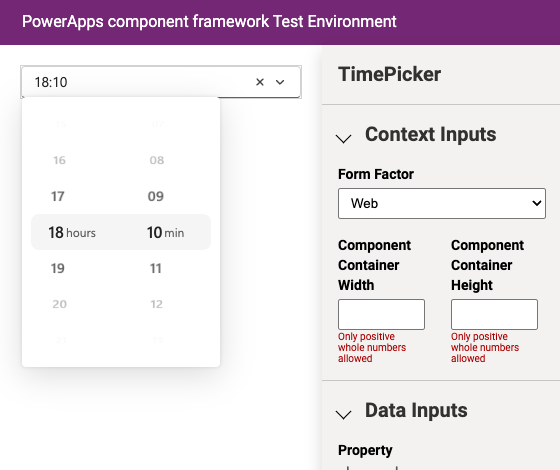

# TimePicker.PCF 

Time picker code component for Power Apps, built with the Power Apps component framework.

It renders a themed input with a searchable list of times, and stores the result in
whole number columns so the value is plain wall-clock time with no time zone
conversion applied anywhere.



## Supported hosts

| Host | Supported | Notes |
|---|---|---|
| Model-driven apps (Dynamics 365) | Yes | Picks up the app's Fluent theme, including dark mode |
| Canvas apps | Yes | |
| Power Pages | Yes | Both storage modes work. Stays a standard component, since Power Pages does not support React platform libraries |

## Storage modes

The component reads and writes whole number columns. Which columns it uses is set by
the **Storage Mode** property.

**Hours and minutes**, the default, uses two columns. `hourvalue` holds 0-23 and
`minutevalue` holds 0-59. Both columns are always written together, so choosing an
hour can never leave the minute column empty. A record that already holds only one of
the two is read as a real time, with the missing half treated as zero, and is left
untouched until the user actually changes the value.

**Minutes from midnight** uses one column. `hourvalue` holds 0-1439 and `minutevalue`
is left unbound. Use it when you would rather keep one column than two, or if you hit
the multi-column binding limitation that the Power Pages documentation describes. The
two column mode is known to work on Power Pages in practice, so this is an option
rather than a requirement.

## Parameters

| Parameter | Description | Default |
|---|---|---|
| `hourvalue` | Whole number column holding the hour, or the whole time in single column mode | required |
| `minutevalue` | Whole number column holding the minute. Leave unbound in single column mode | optional |
| `storagemode` | `Hours and minutes` (two columns) or `Minutes from midnight` (one column) | Hours and minutes |
| `displaytype` | `12 hrs`, `24 hrs`, or `Auto` to follow the user's regional settings | 24 hrs |
| `fieldappearance` | `outline`, `underline`, `filled-darker` or `filled-lighter` | outline |
| `placeholdertext` | Text shown when no time is set | none |
| `showunits` | Show a unit beside the centred row of each wheel | true |
| `hourunittext` | Text beside the hour wheel | `hours`, blank in 12 hour display |
| `minuteunittext` | Text beside the minute wheel | `min` |
| `hourstep` | Interval between selectable hours | 1 |
| `minutestep` | Interval between selectable minutes. Use 60 for whole hours only | 1 |
| `minhour` | First selectable hour, 0-23 | 0 |
| `maxhour` | Last selectable hour, 1-23. Leave blank for 23 | 23 |
| `editenabled` | Allow the user to type a time as well as pick one | false |
| `showclear` | Show a button that clears the value | true |
| `defaulttime` | `Nothing`, or `Current time` to show the user's local time as the placeholder | Nothing |

The picker is two wheels side by side, hours and minutes, in the style of an iOS
picker. Rows snap to a band in the middle and fade out towards the top and bottom.
Choosing on either wheel writes the whole time, so an hour can never be stored without
its minute.

Both wheels open on the current time when the field is empty, so local time is the
first thing the user sees. The current time comes from the Dataverse user's own time
zone when the host exposes it, and from the browser clock otherwise. A stored value
that falls outside the configured hour window, or off the step, is folded into the
wheel so the user can still see what is selected.

Scrolling is the primary interaction, but each wheel is a real listbox: rows can be
clicked, and arrow keys, Page Up and Page Down, Home and End all work.

The centred row carries a unit label, reading `18 hours` and `10 min`. Both labels are
configurable for wording and language, and can be turned off entirely. In 12 hour
display the hour label defaults to blank, because the AM/PM designator already says
what the column is.

With `editenabled` on, the field accepts `18:30`, `18.30`, `1830`, `830`, `18`,
`6:30 pm` and `6pm`. Text that cannot be understood is discarded and the field falls
back to the stored value, so the record never ends up holding junk.

## Upgrading from 1.x

The upgrade is in place. The namespace, the component name, every existing parameter
name and both column types are unchanged, so forms that already use the component keep
working without being touched. Every parameter added in 2.0 is optional and defaults to
the 1.x behaviour.

Three things changed that are worth knowing about:

- `minutevalue` is now optional rather than required. Existing forms already bind it, so
  nothing breaks. Making it optional is what allows the single column mode.
- A record holding an hour but no minute used to be wiped on load. It is now read as a
  time, and the record is left alone until the user changes something.
- The look is supplied by Fluent UI and follows the host theme, so the component no
  longer ships its own hardcoded colours. The 1.x field had a transparent border, which
  is why it appeared to have no border or background on a form.

## Dependencies

[Fluent UI React v9](https://react.fluentui.dev/). The 1.x dependencies on
`rc-time-picker` and `moment` were removed; `rc-time-picker` was last released in
December 2019 and is archived upstream.

## Installation

Install directly from the solution files in the
[Releases](https://github.com/drivardxrm/TimePicker.PCF/releases) section.

## Build

Install the [Power Platform CLI](https://learn.microsoft.com/power-platform/developer/cli/introduction)
and Node.js, then:

```bash
npm install
```

Run the test harness:

```bash
npm start
```

Run the unit tests, which cover the time parsing, formatting and column mapping:

```bash
npm test
```

Produce a release bundle:

```bash
npm run build -- --buildMode production
```

Build the importable Dataverse solution from the `Solution` folder. This works on
macOS and Linux as well as Windows, and needs only the .NET SDK:

```bash
dotnet build -c Release
```

`Solution.zip` (unmanaged) and `Solution_managed.zip` are written to
`Solution/bin/Release`. Change `SolutionPackageType` in `Solution/Solution.cdsproj` to
switch between `Managed`, `Unmanaged` and `Both`.

To push the component straight into an environment while developing, without packaging
a solution:

```bash
pac auth create --environment <environment url>
pac pcf push --publisher-prefix driv
```
